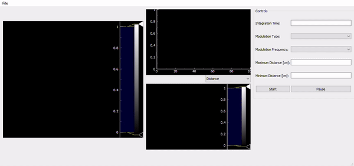

# CaptureGUI

This program is designed to be used to capture and store data for an underwater (UW) LiDAR system at Clarkson University, Potsdam, NY. The software allows for a GUI to control various types of hardware, including camera systems, transmissometers, laser systems, etc. A full list of supported hardware is listed here:  
 
- Espros Epc660 time-of-flight (ToF) camera
- Andor Zyla 5.5 sCMOS RGB camera
- HoloEye spatial light modulator (SLM)
- Seabird Scientific AC-S transmissometer
- Seabird Scientific AC-9 transmissometer
- Custom turbid material dispenser
- Custom stepper motor control target track

The software uses PyQt5 to handle UI events, while sampling and control of hardware devices is done in background threads. An example of the software in use with the Espros Epc660 ToF camera is given here:  

